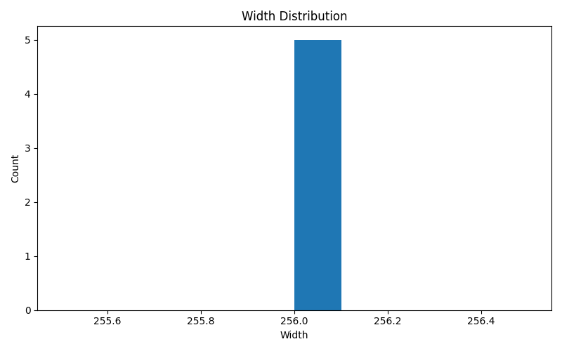
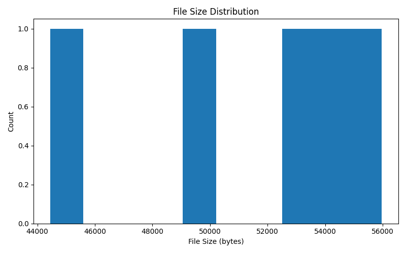
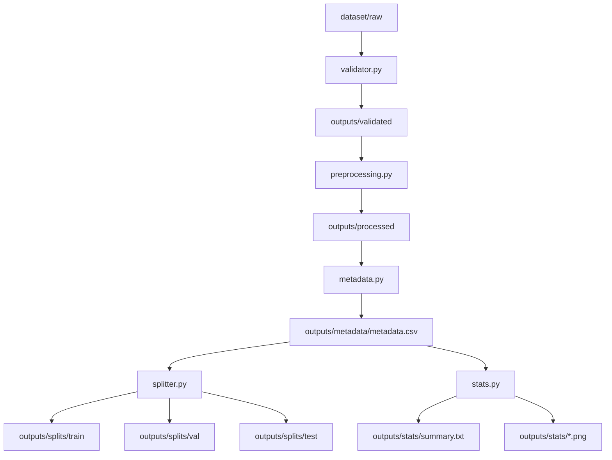

# Computer Vision Dataset Pipeline

---

## 데모


---

## Example Visualization



---



원본 이미지 데이터셋(raw image dataset)을 머신러닝 학습에 사용할 수 있는 **구조화된 데이터셋**으로 자동 변환하는 Python 기반 데이터셋 파이프라인 프로젝트입니다.

이 프로젝트는 컴퓨터 비전 데이터 팀에서 실제로 사용되는 **dataset engineering workflow**를 단순화하여 구현한 포트폴리오 프로젝트입니다.

파이프라인은 다음 작업들을 자동으로 수행합니다.

- 이미지 검증 (Image Validation)
- 이미지 전처리 (Image Preprocessing)
- 메타데이터 생성 (Metadata Generation)
- 데이터셋 분할 (Dataset Split)
- 데이터셋 통계 분석 (Dataset Statistics)

---

# 프로젝트 개요

컴퓨터 비전 프로젝트에서 데이터셋 품질은 모델 성능에 직접적인 영향을 줍니다.

하지만 실제 raw 이미지 데이터셋에는 다음과 같은 문제가 존재하는 경우가 많습니다.

- 손상된 이미지 파일
- 서로 다른 이미지 포맷
- 다양한 해상도
- 데이터셋 구조 미정리

이 프로젝트는 이러한 문제를 해결하기 위해 **이미지 데이터셋 준비 과정을 자동화하는 파이프라인**을 구현합니다.

---

## Pipeline Architecture (Diagram)



각 단계는 독립적인 모듈로 구현되어 있어 확장성과 유지보수성이 높은 구조입니다.

---

# 주요 기능

## Image Validation (이미지 검증)

손상되었거나 읽을 수 없는 이미지 파일을 탐지하고 제거합니다.

예시:

- 깨진 이미지 파일
- 읽을 수 없는 이미지
- 지원되지 않는 이미지 포맷

이 과정을 통해 데이터셋 준비 단계에서 발생할 수 있는 오류를 방지합니다.

---

## Image Preprocessing (이미지 전처리)

머신러닝 모델 학습에 적합하도록 이미지 형식을 표준화합니다.

주요 작업:

- 이미지 크기 조정 (resize)
- RGB 색상 모드 변환
- JPEG 형식으로 변환

예시 출력:

```
256 x 256 RGB
```

---

## Metadata Generation (메타데이터 생성)

데이터셋 정보를 CSV 형태로 생성합니다.

생성되는 컬럼:

| 컬럼 | 설명 |
|-----|------|
| file_name | 이미지 파일 이름 |
| file_path | 파일 전체 경로 |
| width | 이미지 너비 |
| height | 이미지 높이 |
| mode | 색상 모드 |
| format | 이미지 포맷 |
| file_size_bytes | 파일 크기 |

이 메타데이터는 데이터셋 분석 및 디버깅에 활용할 수 있습니다.

---

## Dataset Split (데이터셋 분할)

전처리된 이미지를 다음 세 개의 데이터셋으로 자동 분할합니다.

```
train
validation
test
```

random seed를 사용하여 **재현 가능한 데이터 분할(reproducible split)**을 수행합니다.

---

## Dataset Statistics (데이터셋 통계 분석)

데이터셋의 주요 특성을 분석하고 시각화 결과를 생성합니다.

생성되는 통계:

- 이미지 width 분포
- 이미지 height 분포
- 파일 크기 분포
- 데이터셋 요약 리포트

예시 출력:

```
outputs/stats
├── summary.txt
├── width_distribution.png
├── height_distribution.png
└── file_size_distribution.png
```

예시 요약:

```
Total images: 5
Average width: 256
Average height: 256
Average file size: 51464 bytes
```

---

# Repository Structure

```
cv-dataset-pipeline
│
├── pipeline.py
│
├── src
│   └── pipeline_stages
│      ├── validator.py
│      ├── preprocessing.py
│      ├── metadata.py
│      ├── splitter.py
│      └── stats.py
│
├── dataset
│   └── raw
│
├── outputs
│
├── requirements.txt
└── README.md
```

---

# Installation

필요한 패키지를 설치합니다.

```
pip install -r requirements.txt
```

---

# CLI Help

사용 가능한 명령줄 옵션을 확인하려면 다음 명령을 실행합니다.

```
python pipeline.py --help
```

예시 출력:

```
usage: pipeline.py [-h] --input INPUT --output OUTPUT

Computer Vision Dataset Pipeline

options:
  -h, --help       show this help message and exit
  --input INPUT    Path to raw input image dataset
  --output OUTPUT  Path to output directory
```

---

# 샘플 이미지 생성

파이프라인 테스트를 위해 샘플 이미지를 자동 생성할 수 있습니다.

```
python generate_sample_images.py
```

이 명령을 실행하면 다음 경로에 샘플 이미지가 생성됩니다.

```
dataset/raw
```

손상된 이미지 테스트를 위해 다음과 같이 깨진 파일을 만들 수도 있습니다.

```
echo "not an image" > dataset/raw/broken.jpg
```

---

# Usage

CLI 명령을 사용하여 파이프라인을 실행합니다.

```
python pipeline.py --input dataset/raw --output outputs
```

예시:

```
python pipeline.py --input dataset/raw --output outputs
```

---

# 실행 결과 예시

파이프라인 실행 후 다음과 같은 구조가 생성됩니다.

```
outputs
├── validated
├── processed
├── metadata
│   └── metadata.csv
├── splits
│   ├── train
│   ├── val
│   └── test
└── stats
    ├── summary.txt
    ├── width_distribution.png
    ├── height_distribution.png
    └── file_size_distribution.png
```

---

# 사용 기술

- Python
- pandas
- numpy
- Pillow
- OpenCV
- matplotlib
- tqdm

---

# 프로젝트 목적

이 프로젝트는 컴퓨터 비전 데이터 준비 과정에서 필요한 **데이터 엔지니어링 자동화 능력**을 보여주기 위한 포트폴리오입니다.

주요 역량:

- 데이터셋 검증 자동화
- 이미지 전처리 파이프라인 구축
- 메타데이터 생성
- 재현 가능한 데이터셋 분할
- 데이터셋 분석 및 시각화
