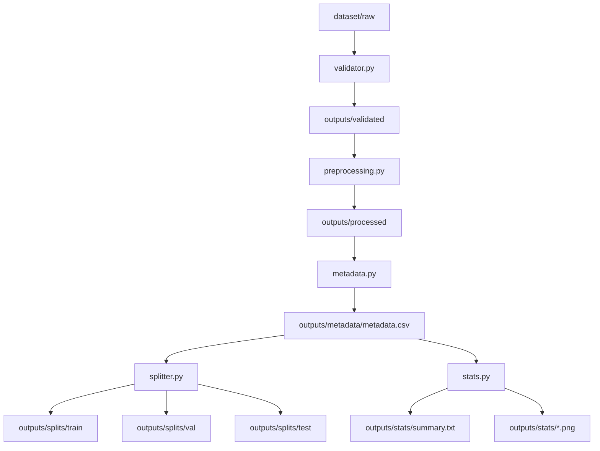

# Computer Vision Dataset Pipeline

## Example Visualization


---


A Python-based automated pipeline for transforming raw image collections into structured **machine-learning-ready datasets**.

This project demonstrates a practical **computer vision dataset engineering workflow** similar to those used in AI data engineering and computer vision data preparation teams.

The pipeline automates dataset preparation including:

- image validation
- image preprocessing
- metadata generation
- dataset splitting
- dataset statistics and visualization

---

# Overview

Preparing high-quality datasets is a critical step in computer vision projects.

Raw image collections often contain issues such as:

- corrupted images
- inconsistent image formats
- varying image resolutions
- missing dataset structure

This pipeline automates the dataset preparation process and converts raw images into a structured dataset suitable for machine learning workflows.

---

## Pipeline Architecture (Diagram)



Each stage is implemented as an independent module to maintain modularity and extensibility.

---

# Features

## Image Validation

Detects and removes corrupted or unreadable image files.

Examples include:

- broken images
- unsupported file formats
- unreadable image data

This prevents failures during later dataset processing or model training.

---

## Image Preprocessing

Standardizes image format for machine learning pipelines.

Processing includes:

- resizing images to a fixed resolution
- converting images to RGB
- normalizing image format (JPEG)

Example output:

```
256 x 256 RGB
```

---

## Metadata Generation

Generates a dataset metadata table (`metadata.csv`).

Example fields:

| column | description |
|------|-------------|
| file_name | image filename |
| file_path | full file path |
| width | image width |
| height | image height |
| mode | color mode |
| format | image format |
| file_size_bytes | file size |

This metadata is useful for dataset inspection and debugging.

---

## Dataset Split

Automatically divides the processed dataset into:

```
train
validation
test
```

The split uses a fixed random seed to ensure **reproducibility**.

---

## Dataset Statistics

Generates dataset analytics including:

- width distribution
- height distribution
- file size distribution
- dataset summary report

Generated outputs:

```
outputs/stats
├── summary.txt
├── width_distribution.png
├── height_distribution.png
└── file_size_distribution.png
```

Example summary:

```
Total images: 5
Average width: 256
Average height: 256
Average file size: 51464 bytes
```

---

# Repository Structure

```
cv-dataset-pipeline
│
├── pipeline.py
│
├── src
│   └── pipeline_stages
│      ├── validator.py
│      ├── preprocessing.py
│      ├── metadata.py
│      ├── splitter.py
│      └── stats.py
│
├── dataset
│   └── raw
│
├── outputs
│
├── requirements.txt
└── README.md
```

---

# Installation

Install required dependencies:

```
pip install -r requirements.txt
```

---

# CLI Help

To see available command-line options:

```
python pipeline.py --help
```

Example output:

```
usage: pipeline.py [-h] --input INPUT --output OUTPUT

Computer Vision Dataset Pipeline

options:
  -h, --help       show this help message and exit
  --input INPUT    Path to raw input image dataset
  --output OUTPUT  Path to output directory
```

---

# Generating Sample Images

You can generate sample images for testing the pipeline.

```
python generate_sample_images.py
```

This will create sample images in:

```
dataset/raw
```

To test validation logic, you can also create a corrupted file:

```
echo "not an image" > dataset/raw/broken.jpg
```

---

# Usage

Run the dataset pipeline using the CLI interface.

```
python pipeline.py --input dataset/raw --output outputs
```

Example:

```
python pipeline.py --input dataset/raw --output outputs
```

---

# Output Example

After execution the following structure will be generated:

```
outputs
├── validated
├── processed
├── metadata
│   └── metadata.csv
├── splits
│   ├── train
│   ├── val
│   └── test
└── stats
    ├── summary.txt
    ├── width_distribution.png
    ├── height_distribution.png
    └── file_size_distribution.png
```

---

# Technologies Used

- Python
- pandas
- numpy
- Pillow
- OpenCV
- matplotlib
- tqdm

---

# Why This Project Matters

Preparing datasets is a critical step in computer vision workflows.

This project demonstrates practical skills in:

- automated dataset validation
- image preprocessing pipelines
- metadata engineering
- reproducible dataset splitting
- dataset analytics and visualization

These workflows are commonly required in **AI data engineering and computer vision dataset preparation pipelines**.

---

# Author

Computer Vision Dataset Pipeline  
Python-based dataset engineering portfolio project.
